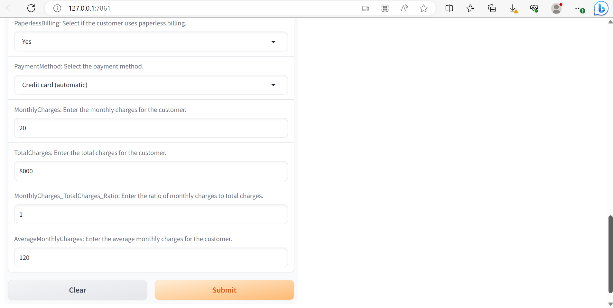

## 🚀Embedding Machine learning Model using Gradio Framework 🤖 🚀 🚀

This project demonstrates the incorporation of a machine learning model into a graphical user interface (GUI) using [Gradio](https://www.gradio.app/) framework. The aim is to create an interactive interface that assists a telecommunications company in managing customer churn. This application was collaboratively developed as part of the Azubi Africa Data Science Training program.

## Prerequisites

Make sure you have the following libraries installed in your Python environment or virtual environment:

* gradio
* pandas==1.5.3
* numpy==1.23.5
* seaborn==0.12.2
* scikit-learn==1.3.0
* gdown

You can install these libraries using the following command:

## Setup 💻 🪛 🔧

To set up and run the Gradio app in your local environment, follow these instructions:

1. Clone this repository to your local machine:

Open a terminal or command prompt on your computer.

Once the cloning process is complete, you can navigate into the cloned directory using the cd command:

**Python:** Make sure you have Python installed on your system. You can download it from Python's official website.

**Virtual Environment (optional but recommended):** It's recommended to use a virtual environment to manage dependencies for your project. You can create a virtual environment using the following commands:

**Required Packages:** Install the required Python packages using pip. You can install them using the provided requirements.txt file:

**Run the Gradio app using the following command:**

 Go to your browser at the following address :

 [App Link](http://127.0.0.1:7861/)

## Preview 🔍 🤖

Below is a preview showcasing the app's appearance.

    

        
Top

        
    

    

        
Buttom

        
    

## Authors 📖 🧑‍🎓

This project was developed during the Azubi Africa Data Science Training. Below is the details of the initial collaborators of this project with respective articles covering the process of the project and their individual github profiles.

| Name                | Article             | Github              |
| ------------------- | ------------------- | ------------------- |
| Isaac Sarpong       |                     |                     |
| Israel Anaba Ayamga | [Bridging Data Science and Actionable Insights: Deploying a Customer Churn Prediction Model with Gradio](https://israelanaba.medium.com/bridging-data-science-and-actionable-insights-deploying-a-customer-churn-prediction-model-with-936b75310f0e) | [Israel_Anaba](https://github.com/Israel-Anaba) |
| Peter Mutiwri       |                     |                     |
| Emmanuel Morkeh     |                     |                     |

## Features ⛑️

**Intelligent Customer Churn Prediction:** Users can input customer attributes such as gender, tenure, internet service type, contract, and more. The machine learning model processes these inputs and provides a prediction about whether the customer is likely to churn or not.

**Instant Prediction Output**: Upon submitting the customer details, the app instantly displays the prediction outcome. If the model predicts that the customer is likely to churn, the output is displayed as "Customer Churn." If not, the output is displayed as "Customer Not Churn."

**Graphical User Interface (GUI)**: The Gradio app provides a user-friendly graphical interface that allows users to interact with a machine learning model trained to aid the prediction of a Telco Customer Churn.

## Usage Instructions 🧑‍🏫

**Input Customer Details:**
Fill out the customer attributes in the input fields. You can select options from dropdowns and enter numerical values as required.

**View Churn Prediction:**
After entering the customer details, click the "Predict" button. The app will process the information and display the churn prediction in the output section. The prediction will be either "Customer Churn" or "Customer Not Churn."

**Explore Different Scenarios:**
Feel free to experiment with different customer attribute combinations to see how they affect the churn prediction. The app provides instant feedback for each scenario.

## Troubleshooting 🛠️

**Invalid Input Values:** Ensure that you are entering valid input values in the provided fields. Make sure to follow the specified data type and range for each input. For example, ensure that numerical inputs like "Monthly Charges" and "Total Charges" are within the specified range.

**Library Versions:** Double-check that you have installed the required libraries with the correct versions as mentioned in the README file. Incorrect library versions can lead to compatibility issues and unexpected behavior.

**Missing Libraries:** If you encounter import errors or missing module issues, make sure that all required libraries are properly installed in your Python environment. You can use the provided requirements.txt file to install the required dependencies.

**NB**: you encounter any issues with the app, ensure that you have the required libraries installed and that the "my_exported_components.pkl" file is in the correct location.

## Resources

Here are a few recommended resources to help you gain a solid understanding of Gradio:

[Get started with Gradio](https://gradio.app/getting_started/)

## License

This project is licensed under the [MIT License](LICENSE)

## Acknowledgments

Special thanks to Azubi Africa for providing the training and opportunity to work on this project.
